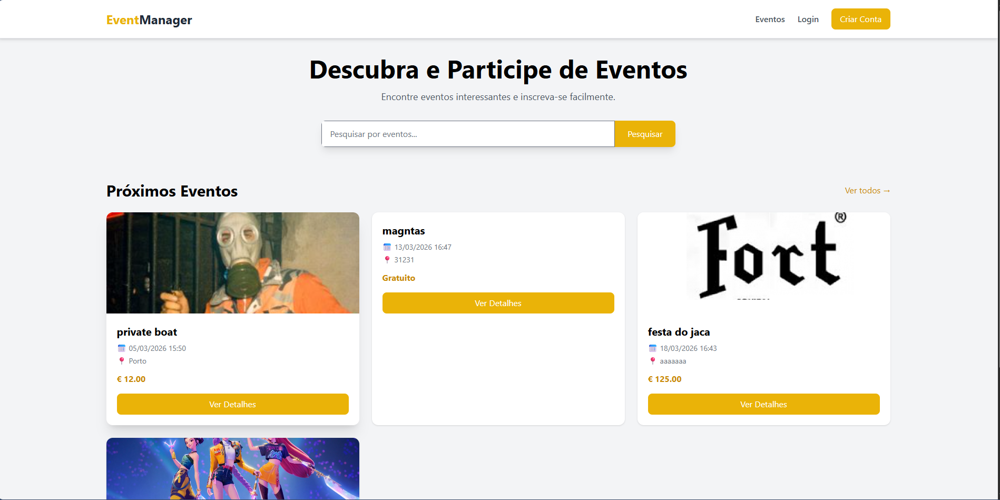
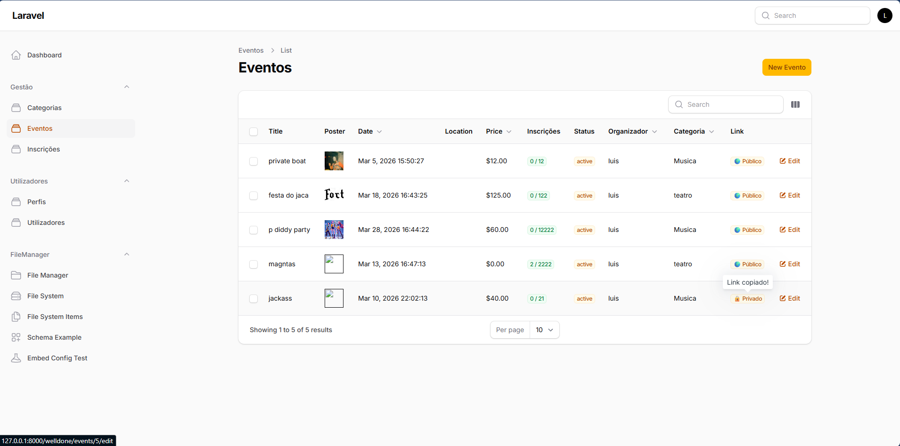
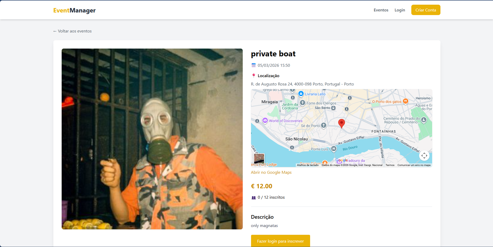
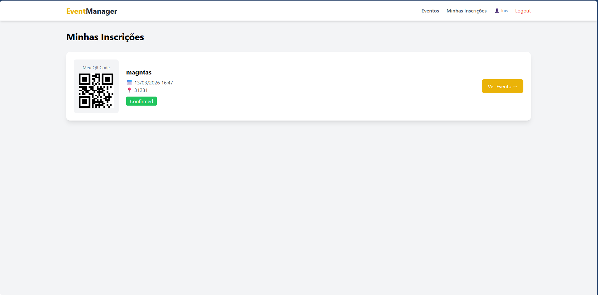
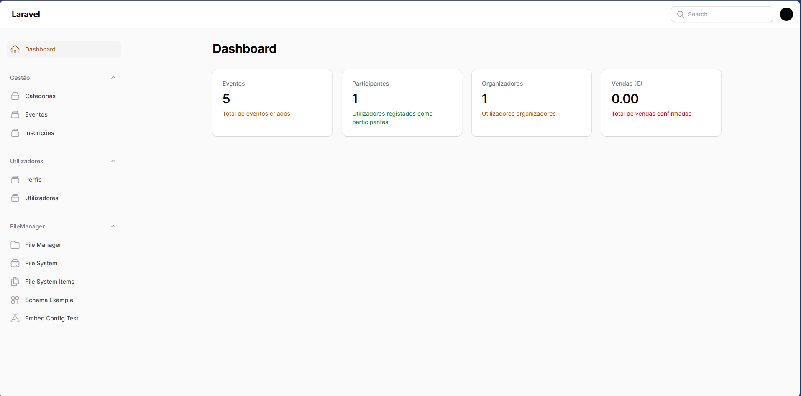
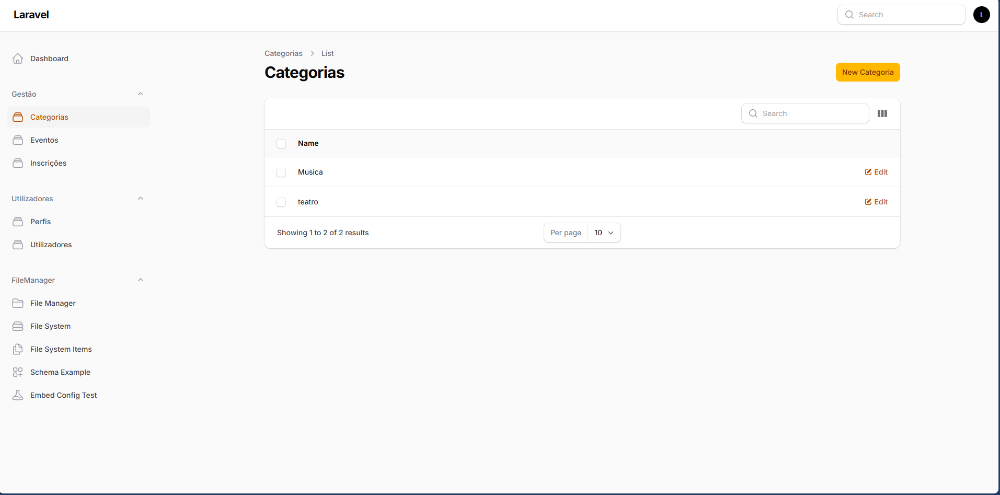
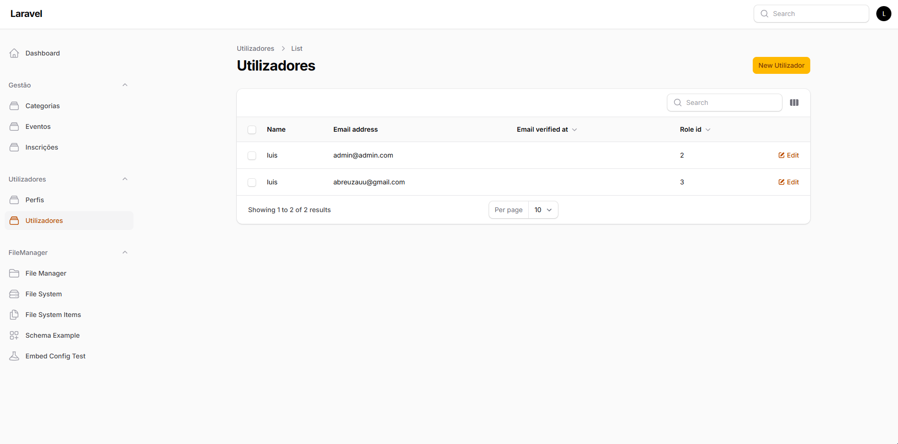
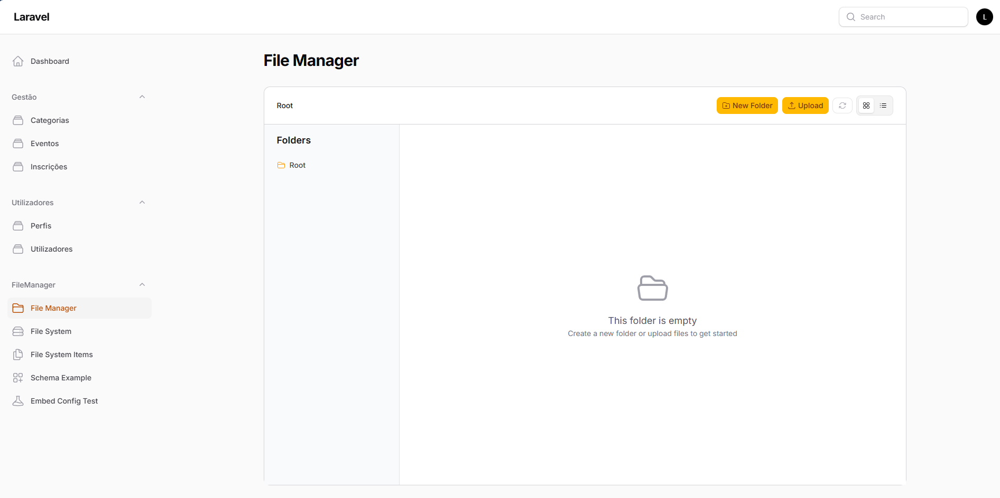
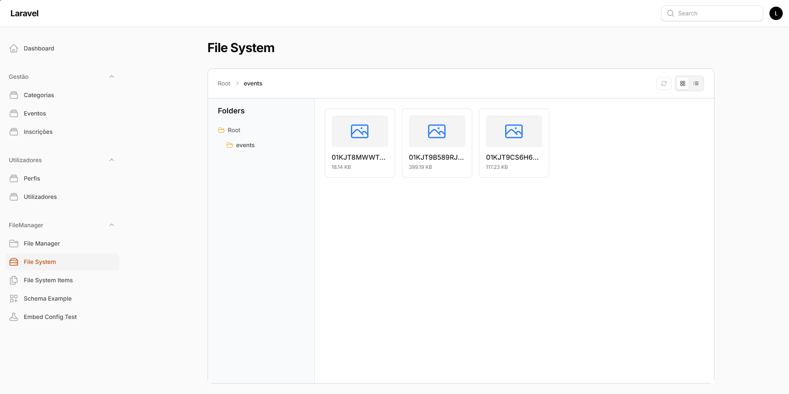

# 🎟 Gestão de Eventos

Aplicação web para gestão e participação em eventos, desenvolvida em **Laravel**.  
Permite criar eventos, gerir inscrições e validar entradas através de **QR Code**.

---

# 🚀 Funcionalidades

### 👤 Utilizadores
- Registo e login de participantes
- Visualização de eventos disponíveis
- Inscrição em eventos
- Visualização das próprias inscrições
- QR Code gerado automaticamente para cada inscrição

### 🎪 Organizadores
- Criar e gerir eventos
- Definir capacidade, preço e data
- Definir eventos públicos ou privados
- Visualizar inscrições dos participantes

### 🛠 Administradores
- Gestão total da plataforma
- Gestão de eventos
- Gestão de utilizadores
- Gestão de categorias

### 📍 Eventos
- Cartaz do evento
- Descrição
- Data e hora
- Localização com **Google Maps**
- Número máximo de participantes
- Preço (gratuito ou pago)

### 🔐 Eventos Privados
- Eventos privados acessíveis apenas através de **link de convite**
- Token único para acesso ao evento

### 📱 Check-in
- Cada inscrição gera um **QR Code**
- QR Code pode ser utilizado para validação de entrada no evento

### 🗂 Painel de Administração
Construído com **Filament Admin Panel**.

Permite:

- Gerir eventos
- Ver inscrições
- Upload de ficheiros com **FileManager**
- Gestão de categorias

---

# 🛠 Tecnologias Utilizadas

- **Laravel**
- **Filament Admin Panel**
- **TailwindCSS**
- **MySQL**
- **Google Maps API**
- **QR Code**

---

# 📦 Requisitos

Antes de instalar é necessário ter:

- PHP >= 8.2
- Composer
- Node.js
- NPM
- MySQL
- Git

---

## ⚙️ Instalação

Siga os passos abaixo para instalar e executar o projeto localmente.

### 1️⃣ Clonar o repositório

```bash
git clone https://github.com/seu-utilizador/gestao-eventos.git
cd gestao-eventos
2️⃣ Instalar dependências PHP

Instalar as dependências do Laravel utilizando o Composer.

composer install
3️⃣ Instalar dependências frontend

Instalar as dependências do frontend.

npm install
4️⃣ Criar ficheiro de configuração .env

Copiar o ficheiro de exemplo e criar o ficheiro .env.

cp .env.example .env
5️⃣ Gerar chave da aplicação

Gerar a chave de segurança da aplicação Laravel.

php artisan key:generate
6️⃣ Configurar base de dados

Editar o ficheiro .env e configurar a ligação à base de dados:

DB_DATABASE=gestao_eventos
DB_USERNAME=root
DB_PASSWORD=

Criar previamente a base de dados no MySQL.

7️⃣ Executar migrations

Criar todas as tabelas necessárias na base de dados.

php artisan migrate
8️⃣ Criar link de storage

Permite que as imagens e ficheiros armazenados em storage sejam acessíveis publicamente.

php artisan storage:link
9️⃣ Compilar os assets frontend
npm run dev
🔟 Iniciar o servidor local
php artisan serve

A aplicação ficará disponível em:

http://127.0.0.1:8000
🔐 Painel de Administração

O painel de administração pode ser acedido em:

http://127.0.0.1:8000/welldone

💡 **Dica:**  
Depois no README podes também adicionar uma secção tipo:
```
## 📸 Screenshots

### 🏠 Homepage



---

### 🎪 Eventos



---

### 📄 Detalhes do Evento



---

### 🎟 Minhas Inscrições



---

### 🗂 Painel de Administração



---

### 📂 Gestão de Categorias



---

### 👥 Gestão de Utilizadores



---

### 📁 File Manager



---

### 🗄 File System


